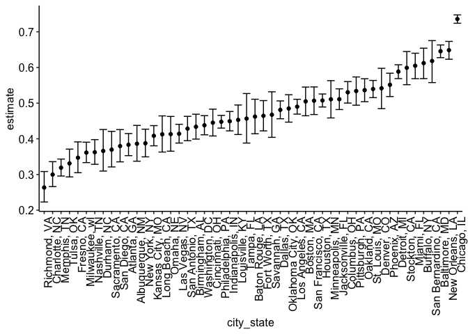
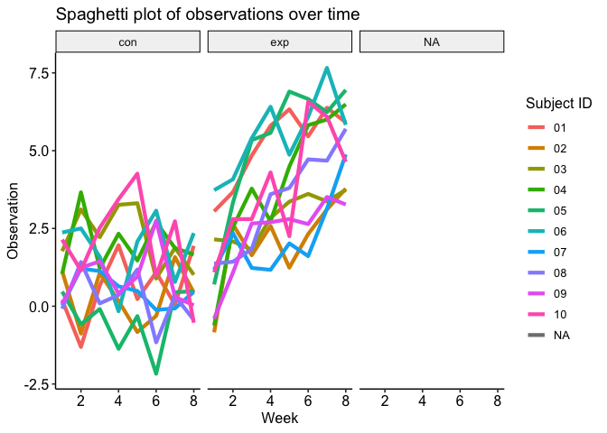
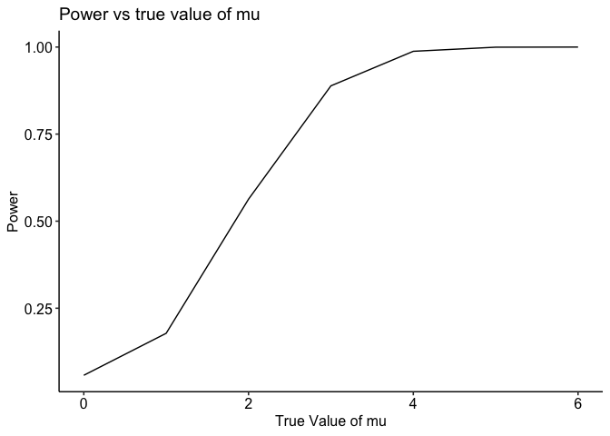
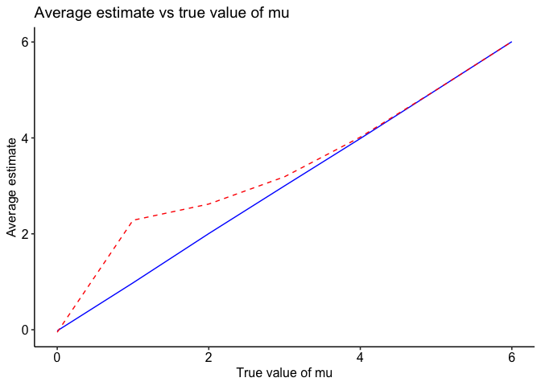

p8105_hw5_wl2926
================
2023-10-18

## Problem 1

For this problem, we are interested in data gathered and made public by
*The Washington Post* on homicides in 50 large U.S. cities. The code
chunk below imports and cleans the data.

``` r
homicide_df = 
  read_csv("data/homicide-data.csv", na = c("", "NA", "Unknown")) %>%
  mutate(
    city_state = str_c(city, state, sep = ", "),
    resolution = case_when(
      disposition == "Closed without arrest" ~ "unsolved",
      disposition == "Open/No arrest"        ~ "unsolved",
      disposition == "Closed by arrest"      ~ "solved"
    )
  ) %>% 
  filter(city_state != "Tulsa, AL") 
```

The resulting dataframe has 52178 entries, on variables that include the
victim name, race, age, and sex; the date the homicide was reported; and
the location of the homicide. In cleaning, I created a `city_state`
variable that includes both city and state, and a `resolution` variable
to indicate whether the case was closed by arrest. I also excluded one
entry in Tulsa, AL, which is not a major US city and is most likely a
data entry error.

In the next code chunk, I group within cities and summarize to produce
the total number of homicides and the number that are solved.

``` r
city_homicide_df = 
  homicide_df %>% 
  select(city_state, disposition, resolution) %>% 
  group_by(city_state) %>% 
  summarize(
    hom_total = n(),
    hom_unsolved = sum(resolution == "unsolved"))
```

Focusing only on Baltimore, MD, I can use the `prop.test` and
`broom::tidy` functions to obtain an estimate and CI of the proportion
of unsolved homicides in that city. The table below shows those values.

``` r
bmore_test = 
  prop.test(
    x = filter(city_homicide_df, city_state == "Baltimore, MD") %>% pull(hom_unsolved),
    n = filter(city_homicide_df, city_state == "Baltimore, MD") %>% pull(hom_total)) 

broom::tidy(bmore_test) %>% 
  knitr::kable(digits = 3)
```

| estimate | statistic | p.value | parameter | conf.low | conf.high | method                                               | alternative |
|---------:|----------:|--------:|----------:|---------:|----------:|:-----------------------------------------------------|:------------|
|    0.646 |   239.011 |       0 |         1 |    0.628 |     0.663 | 1-sample proportions test with continuity correction | two.sided   |

Building on this code, I can use functions in the `purrr` package to
obtain estimates and CIs for the proportion of unsolved homicides in
each city in my dataset. The code below implements this analysis.

``` r
test_results = 
  city_homicide_df %>% 
  mutate(
    prop_tests = map2(hom_unsolved, hom_total, \(x, y) prop.test(x = x, n = y)),
    tidy_tests = map(prop_tests, broom::tidy)) %>% 
  select(-prop_tests) %>% 
  unnest(tidy_tests) %>% 
  select(city_state, estimate, conf.low, conf.high) %>% 
  mutate(city_state = fct_reorder(city_state, estimate))
```

Finally, I make a plot showing the estimate (and CI) of the proportion
of unsolved homicides in each city.

``` r
test_results %>% 
  mutate(city_state = fct_reorder(city_state, estimate)) %>% 
  ggplot(aes(x = city_state, y = estimate)) + 
  geom_point() + 
  geom_errorbar(aes(ymin = conf.low, ymax = conf.high)) + 
  theme(axis.text.x = element_text(angle = 90, hjust = 1))
```

<!-- -->

This figure suggests a very wide range in the rate at which homicides
are solved – Chicago is noticeably high and, given the narrowness of the
CI, likely is the location of many homicides.

# Problem 2: Data from a longitudinal study.

``` r
#get the list of file names
file_names <- list.files(path = "data/",
                         pattern = ".csv",
                         full.names = TRUE)
file_names
```

    ##  [1] "data//con_01.csv"        "data//con_02.csv"       
    ##  [3] "data//con_03.csv"        "data//con_04.csv"       
    ##  [5] "data//con_05.csv"        "data//con_06.csv"       
    ##  [7] "data//con_07.csv"        "data//con_08.csv"       
    ##  [9] "data//con_09.csv"        "data//con_10.csv"       
    ## [11] "data//exp_01.csv"        "data//exp_02.csv"       
    ## [13] "data//exp_03.csv"        "data//exp_04.csv"       
    ## [15] "data//exp_05.csv"        "data//exp_06.csv"       
    ## [17] "data//exp_07.csv"        "data//exp_08.csv"       
    ## [19] "data//exp_09.csv"        "data//exp_10.csv"       
    ## [21] "data//homicide-data.csv"

``` r
#data importation and preparation
longitudinal_data <- tibble(file = file_names) %>%
  mutate(
    arm = str_extract(file, "(con|exp)"), #arm group names from file names
    subject_id = str_extract(file, "\\d+"),#subjectID as numeric part,file name
    data = purrr::map(file, read_csv)) %>% #import data
  unnest(data) %>%#expand data list into rows and columns
  select(subject_id, arm, everything()) %>%
  select(-file) #remove file names column
#view first few rows of resulting tibble
longitudinal_data[c(1:4, 16:20),]
```

    ## # A tibble: 9 × 22
    ##   subject_id arm   week_1 week_2 week_3 week_4 week_5 week_6 week_7 week_8 uid  
    ##   <chr>      <chr>  <dbl>  <dbl>  <dbl>  <dbl>  <dbl>  <dbl>  <dbl>  <dbl> <chr>
    ## 1 01         con     0.2   -1.31   0.66   1.96   0.23   1.09   0.05   1.94 <NA> 
    ## 2 02         con     1.13  -0.88   1.07   0.17  -0.83  -0.31   1.58   0.44 <NA> 
    ## 3 03         con     1.77   3.11   2.22   3.26   3.31   0.89   1.88   1.01 <NA> 
    ## 4 04         con     1.04   3.66   1.22   2.33   1.47   2.7    1.87   1.66 <NA> 
    ## 5 06         exp     3.73   4.08   5.4    6.41   4.87   6.09   7.66   5.83 <NA> 
    ## 6 07         exp     1.18   2.35   1.23   1.17   2.02   1.61   3.13   4.88 <NA> 
    ## 7 08         exp     1.37   1.43   1.84   3.6    3.8    4.72   4.68   5.7  <NA> 
    ## 8 09         exp    -0.4    1.08   2.66   2.7    2.8    2.64   3.51   3.27 <NA> 
    ## 9 10         exp     1.09   2.8    2.8    4.3    2.25   6.57   6.09   4.64 <NA> 
    ## # ℹ 11 more variables: reported_date <dbl>, victim_last <chr>,
    ## #   victim_first <chr>, victim_race <chr>, victim_age <chr>, victim_sex <chr>,
    ## #   city <chr>, state <chr>, lat <dbl>, lon <dbl>, disposition <chr>

``` r
#convert data to long format for ease of plotting
spaghetti_plot_data <- longitudinal_data %>%
  pivot_longer(cols = starts_with("week_"), names_to = "week",
               values_to = "value") %>%
  mutate(week_numeric = as.numeric(sub("week_", "", week))) 

#spaghetti plot of subjects grouped by arm over time.
ggplot(spaghetti_plot_data, aes(x = week_numeric, y = value,
                              group = subject_id, color=subject_id)) +
  geom_line(linewidth=1.5) +
  facet_grid(~arm) +
  labs(title = "Spaghetti plot of observations over time",
       x = "Week",
       y = "Observation",
       color="Subject ID")
```

<!-- --> The
experimental group’s observations are increasing with time, while the
observations for the control group appear to oscillate around the same
values.

# Problem 3: Effect size and power in study design.

``` r
#set random number generator seed
set.seed(1111)
#set design elements
n <- 30
sigma <- 5
alpha <- 0.05
num_datasets <- 5000
true_mu <- 0  #specify mu value
simulations_mu_0 <- tibble(
  true_mu = rep(true_mu, num_datasets),
  data = map(1:num_datasets, ~rnorm(n, mean = true_mu, sd = sigma)),
  test_result = map(data, ~broom::tidy(t.test(.x, mu = 0)))) %>%
  unnest(test_result) %>%
  mutate(reject_null = p.value < alpha,
         estimate_rejected = if_else(reject_null, estimate, NA_real_))
#calculate power for mu=0
power_mu_0 <- mean(simulations_mu_0$reject_null)
power_mu_0
```

    ## [1] 0.0574

``` r
#compute average estimate for mu
avg_estimate_mu_0 <- mean(simulations_mu_0$estimate)
avg_estimate_mu_0
```

    ## [1] -0.02252955

``` r
#compute average estimate for rejected samples only
avg_estimate_rejected_mu_0 <- mean(simulations_mu_0$estimate_rejected, 
                                   na.rm = TRUE)
avg_estimate_rejected_mu_0
```

    ## [1] -0.05242414

``` r
#set seed for reproducibility
set.seed(1111)
#define design elements
n <- 30
sigma <- 5
alpha <- 0.05
num_datasets <- 5000
#list of the other mu values
mu_values <- c(1, 2, 3, 4, 5, 6)
#initialize an empty data frame to store results
results_df <- tibble()
#loop through each mu value
for (mu in mu_values) {
  simulations_mu <- tibble(
    true_mu = rep(mu, num_datasets),
    data = map(1:num_datasets, ~rnorm(n, mean = mu, sd = sigma)),
    test_result = map(data, ~broom::tidy(t.test(.x, mu = 0)))) %>%
    unnest(test_result) %>% mutate(
      reject_null = p.value < alpha,
      estimate_rejected = if_else(reject_null, estimate, NA_real_))
  #calculate power for the current mu
  power_mu <- mean(simulations_mu$reject_null)
  #compute average estimate for the current mu
  avg_estimate_mu <- mean(simulations_mu$estimate)
  #compute average estimate for rejected samples only
  avg_estimate_rejected_mu <- mean(simulations_mu$estimate_rejected, 
                                   na.rm = TRUE)
  #add results to the overall data frame
  results_df <- bind_rows(results_df, tibble(
    true_mu = mu,
    power = power_mu,
    avg_estimate = avg_estimate_mu,
    avg_estimate_rejected = avg_estimate_rejected_mu))
}
#merge results for mu=0 with the overall results
results_df <- bind_rows(
  tibble(
    true_mu = 0,
    power = power_mu_0,
    avg_estimate = avg_estimate_mu_0,
    avg_estimate_rejected=avg_estimate_rejected_mu_0), results_df)
#print the results data frame
print(results_df)
```

    ## # A tibble: 7 × 4
    ##   true_mu  power avg_estimate avg_estimate_rejected
    ##     <dbl>  <dbl>        <dbl>                 <dbl>
    ## 1       0 0.0574      -0.0225               -0.0524
    ## 2       1 0.178        0.977                 2.28  
    ## 3       2 0.563        2.00                  2.62  
    ## 4       3 0.889        3.00                  3.19  
    ## 5       4 0.988        3.99                  4.02  
    ## 6       5 1.00         5.00                  5.00  
    ## 7       6 1            6.01                  6.01

## Question 1: Make a plot showing the proportion of times the null hypothesis was rejected (the power of the test) on the y-axis and the true value of (mu) on the x-axis. Describe the association between effect size and power.

``` r
#Power vs true value of mu
ggplot(results_df, aes(x = true_mu, y = power)) +
  geom_line() +
  labs(title = "Power vs true value of mu",
       x = "True Value of mu",
       y = "Power")
```

<!-- -->

The power of a statistical test is the probability of correctly
rejecting a false null hypothesis. The graph indicates a rising trend,
which implies increased power as the effect size (mu) becomes larger for
a one-sample t-test.  
When the true value of effect size is zero (mu=0), the power is low
(0.0484). This indicates that the one-sample t-test has a low
probability of correctly rejecting a false null hypothesis when the
true.  
For the other effect sizes (mu), an increase in mu results to an
increase in power. This is expected, as larger effect sizes, when
present, are more likely to be correctly detected, hence the rise in
higher power.

## Question 2: Make a plot showing the average estimate of mu_hat on the y-axis and the true value of mu on the x-axis. Make a second plot (or overlay on the first) of the average estimate of mu_hat, only in samples for which the null hypothesis was rejected on the y-axis, and the true value of mμ on the x-axis. Is the sample average of mu_hat across tests for which the null hypothesis is rejected approximately equal to the true value of mu? Why or why not?

``` r
#average mu estimates vs true value of mu
ggplot(results_df, aes(x = true_mu)) +
  geom_line(aes(y = avg_estimate), color = "blue", linetype = "solid") +
  geom_line(aes(y = avg_estimate_rejected), color = "red", linetype = "dashed") +
  labs(title = "Average estimate vs true value of mu",
       x = "True value of mu",
       y = "Average estimate")
```

<!-- -->
For smaller mu sizes (mu \< 3) values, the average mu estimate for all
samples is smaller and better approximates of the true mu values,
compared to the average mu estimates for only the samples where the null
hypothesis is rejected. On the other hand, the larger mu values, both
the full, and null-hypothesis-rejected sample average estimates are
approximately equal.

When the true mu is small (e.g., mu=1), the effect size is subtle. In
this scenario, the average estimate across all samples tends to be
closer to the true effect size mu because the data from all samples,
including those where the null hypothesis is not rejected, contribute to
the average. In samples where the null hypothesis is rejected, the
estimate may be influenced by noise, leading to a slightly larger
average estimate.  
When the mu is large (e.g., mu=5), the effect size is more pronounced.
In this case, the average estimate across all samples is still close to
the true effect size mu, because the effect is strong and detectable in
most of the samples. In samples where the null hypothesis is rejected,
the estimate converges to the true mu more closely because the effect
size is significant.
